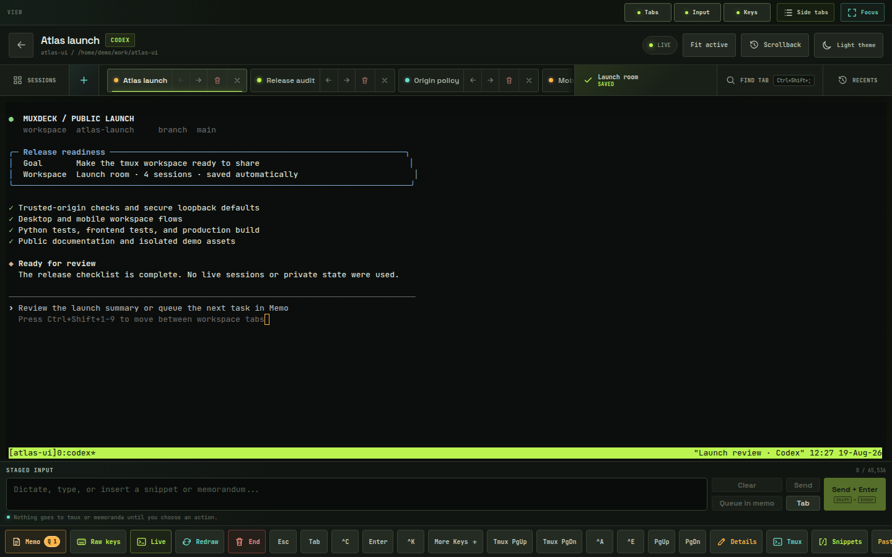
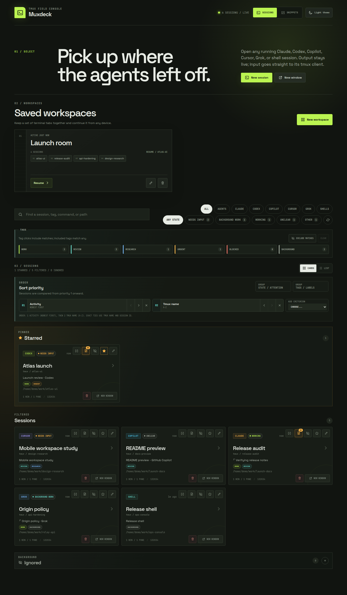
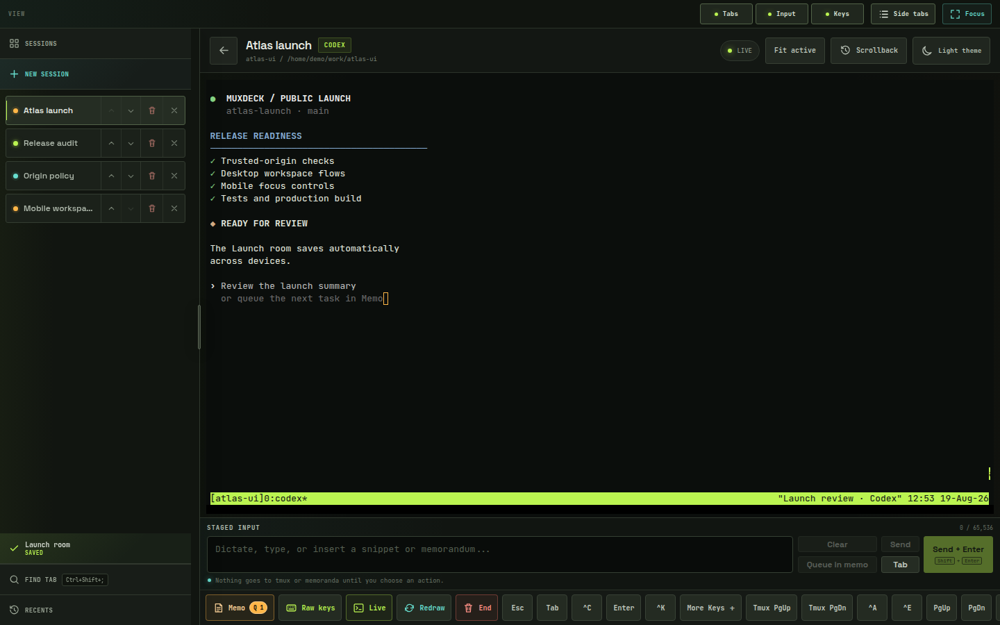
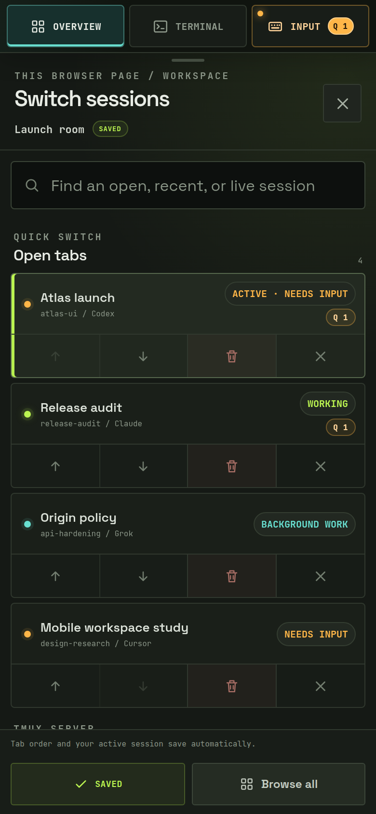
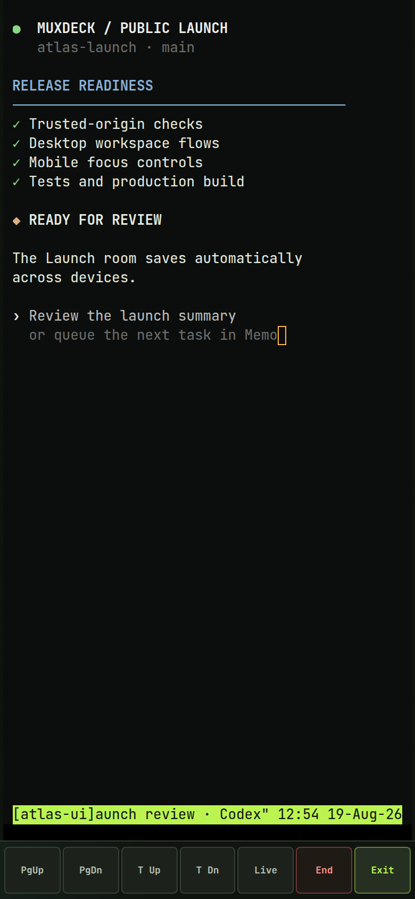
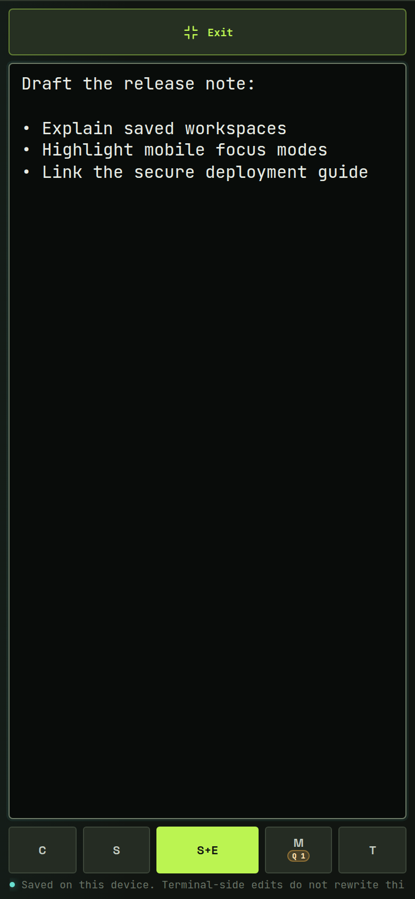

# Muxdeck

Muxdeck is a mobile-friendly web console for monitoring and controlling tmux
sessions from a browser. It combines real PTY terminals with persistent
workspaces, session organization, and status detection for Claude Code, Codex,
GitHub Copilot CLI, Cursor Agent, and Grok Build.

> [!CAUTION]
> Muxdeck has no application-level authentication. Anyone who can reach it can
> control shells with the tmux owner's privileges. Keep it bound to loopback and
> use only a private tunnel/network or an authenticated, access-controlled
> reverse proxy. Do not publish its HTTP port directly to the internet.

## Screenshots

### Desktop

  

<table>
  <tr>
    <td width="50%"></td>
    <td width="50%"></td>
  </tr>
  <tr>
    <td align="center">Session dashboard</td>
    <td align="center">Adjustable side tabs</td>
  </tr>
</table>

### Mobile

<table>
  <tr>
    <td width="33%"></td>
    <td width="33%"></td>
    <td width="33%"></td>
  </tr>
  <tr>
    <td align="center">Overview</td>
    <td align="center">Terminal focus</td>
    <td align="center">Input focus</td>
  </tr>
</table>

## Highlights

- Live tmux inventory with conservative status detection for Claude Code, Codex,
  GitHub Copilot CLI, Cursor Agent, and Grok Build
- Real xterm.js terminals with direct keyboard input and responsive desktop,
  tablet, and phone layouts
- Persistent named workspaces with colored, collapsible tab groups, ordered top
  or side tabs, common/workspace quick-link shelves, and cross-device resume
- Session titles, tags, search, filters, grouping, stars, and an ignored-session
  bucket
- Dictation-friendly staged input, durable per-session memos, queued-input
  indicators, and reusable snippets
- Confirmed session creation, native rename, and whole-session termination
- Light/dark appearance, reconnect support, and retained tmux scrollback snapshots

## Quick start

Requirements: Python 3.11+, tmux 3.x, and Node.js `^20.19.0` or
`>=22.12.0`.

~~~bash
git clone https://github.com/lovinrain/tmux-web-console.git
cd tmux-web-console
python3 -m venv .venv
.venv/bin/python -m pip install -e .
npm ci
npm run build
.venv/bin/python -m tmux_console.app
~~~

Open `http://127.0.0.1:7683/mux/`.

For frontend development, run `npm run dev`. Vite serves
`http://127.0.0.1:5173/mux/` and proxies the API and WebSocket to port 7683.

## Important behavior

- Opening a console attaches a real tmux client. Closing the browser disconnects
  that client but leaves the tmux session and foreground process running.
- A tab's `X` and workspace deletion only remove Muxdeck navigation records.
  `End` terminates the entire tmux session after confirmation.
- `Fit active` may resize the shared tmux window. Use `Size protected` when
  observing a valuable session without disturbing another client.
- A staged-input acknowledgement confirms only that bytes reached the PTY, not
  that a command or agent turn completed. Uncertain deliveries are never
  retried automatically.
- Agent activity is inferred conservatively from tmux-visible signals.
  Unsupported or ambiguous states appear as `Unclear` instead of being guessed.
- Alternate-screen applications may leave no retained tmux history; Muxdeck
  cannot reconstruct output tmux did not save.

## Workspace shortcuts

`Ctrl+Shift+H` toggles the saved light/dark theme from any Muxdeck screen,
including the landing page and compact mobile layout.

These shortcuts are active in the desktop multi-tab view, not on the landing
page or compact mobile layout.

| Shortcut | Action |
| --- | --- |
| `Ctrl+Shift+B` | Open New session in the current workspace |
| `Ctrl+Shift+,` | Previous tab |
| `Ctrl+Shift+.` | Next tab |
| `Ctrl+Shift+1...9` | Jump to a numbered tab |
| `Ctrl+Shift+;` | Find a tab by title, tmux name, or group |
| `Ctrl+Shift+A` | Show or hide tab action buttons |
| `Ctrl+Shift+S` | Show or hide the session tab strip |
| `Ctrl+Shift+F` | Enter or exit terminal Focus |
| `Ctrl+Shift+U` / `Ctrl+Shift+D` | Page with the current agent's remembered controls |
| `Ctrl+Shift+L` | Leave scrollback and return to live output |
| `Ctrl+Shift+C` | Toggle browser terminal Copy mode |
| `Ctrl+Shift+M` | Create and open a numbered session in the active pane's directory |
| `Ctrl+Shift+E` | Open the End-session confirmation |

Use `Keymap` in the desktop workspace strip to see these chords in the app.
Muxdeck highlights whether raw Page Up/Page Down or tmux history is preferred for
the active agent, and successful paging-button use remembers that choice locally.

## Deployment and security

Follow [`AGENT_DEPLOYMENT_GUIDE.md`](AGENT_DEPLOYMENT_GUIDE.md) for fresh
installs, state migration, systemd, Caddy, validation, upgrades, and rollback.
Report vulnerabilities through the private process in
[`SECURITY.md`](SECURITY.md).

Keep `MUXDECK_HOST=127.0.0.1`. For a reverse proxy, list each exact external
origin and preserve the browser's `Host` and `Origin` headers:

~~~bash
MUXDECK_TRUSTED_ORIGINS=https://console.example.test
~~~

Origin validation prevents cross-site requests and DNS rebinding; it is not
authentication. Titles, session names, memos, snippets, and workspace state can
contain sensitive information and should remain outside the source tree.

## Configuration

| Variable | Default | Purpose |
| --- | --- | --- |
| `MUXDECK_HOST` | `127.0.0.1` | HTTP listen address |
| `MUXDECK_PORT` | `7683` | HTTP listen port |
| `MUXDECK_BASE_PATH` | `/mux` | API, WebSocket, and SPA prefix |
| `MUXDECK_TRUSTED_ORIGINS` | unset | Exact external origins allowed through a proxy |
| `TMUX_BIN` | `tmux` | tmux executable |
| `MUXDECK_TMUX_SOCKET` | unset | Optional tmux socket name |

The [complete reference](docs/REFERENCE.md#configuration) documents persistence
paths and every runtime setting.

## Development

~~~bash
.venv/bin/python -m pip install -e '.[dev]'
.venv/bin/python -m pytest -q
npm test
npm run build
npm run test:e2e
~~~

Python and Playwright end-to-end tests use isolated disposable tmux sockets and
never target the default tmux server.

## Documentation

- [Detailed behavior and complete configuration](docs/REFERENCE.md)
- [Deployment, migration, validation, and rollback](AGENT_DEPLOYMENT_GUIDE.md)
- [Vulnerability reporting and the security boundary](SECURITY.md)
