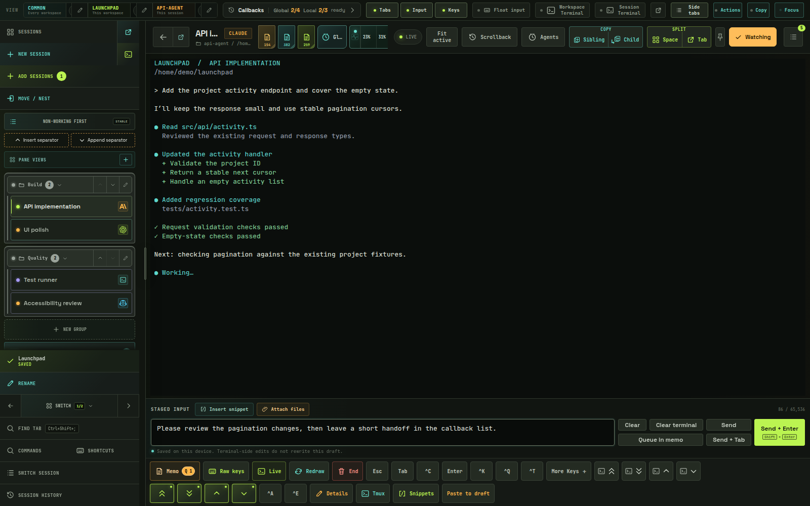
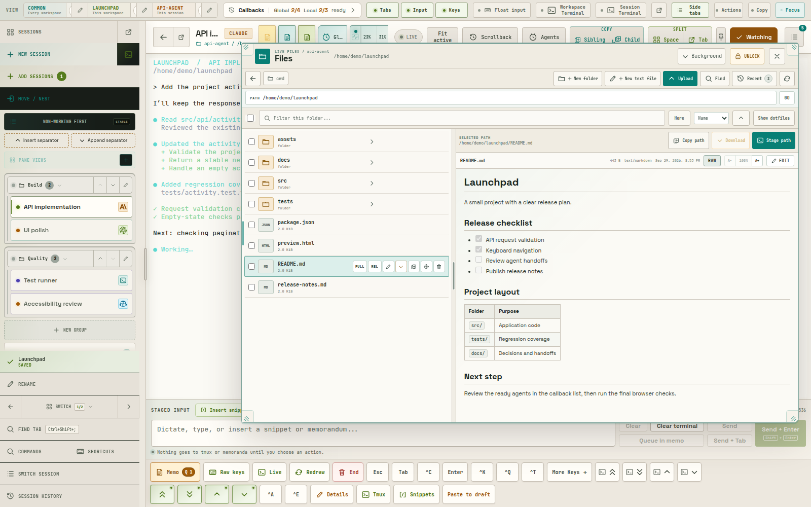
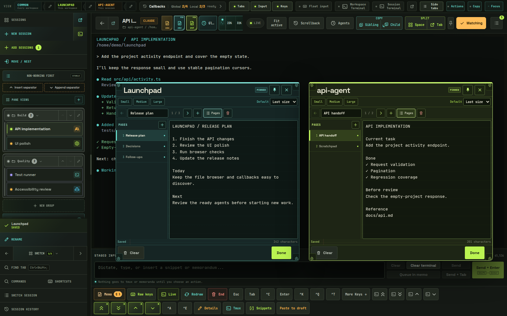
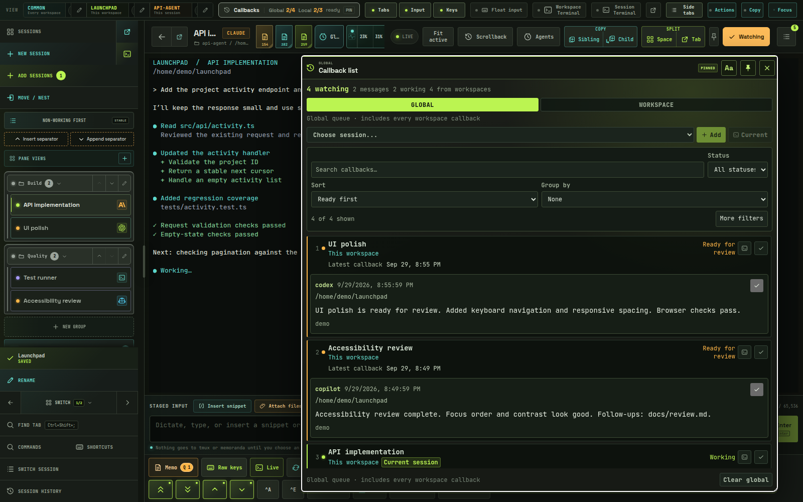
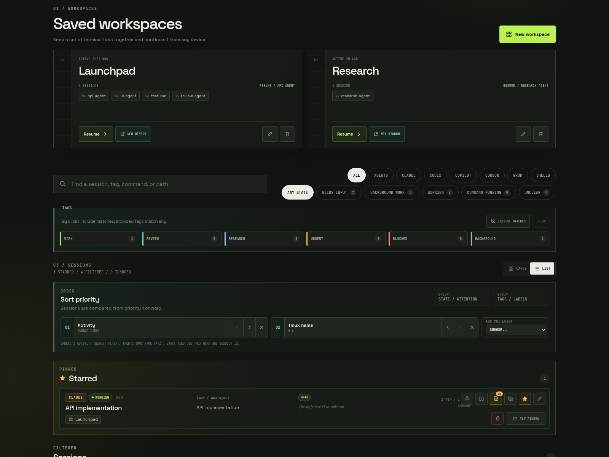
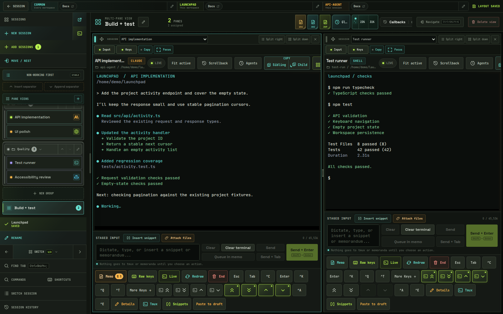
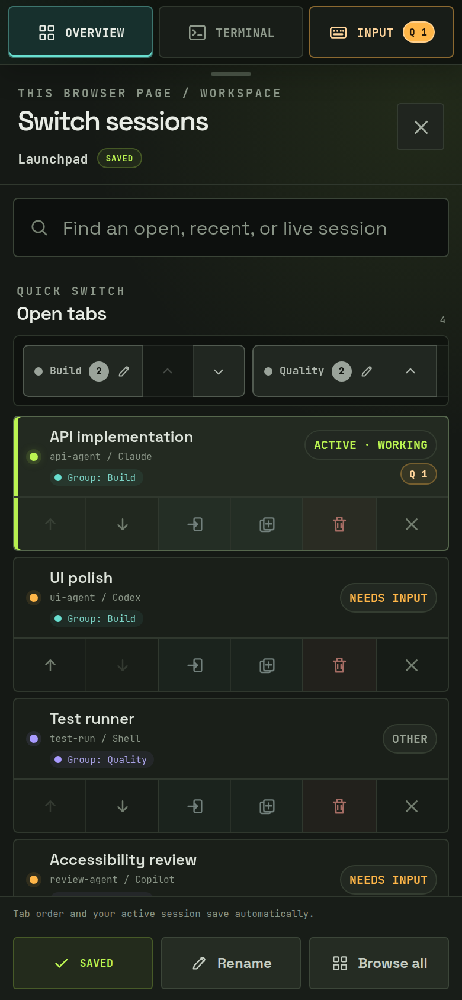
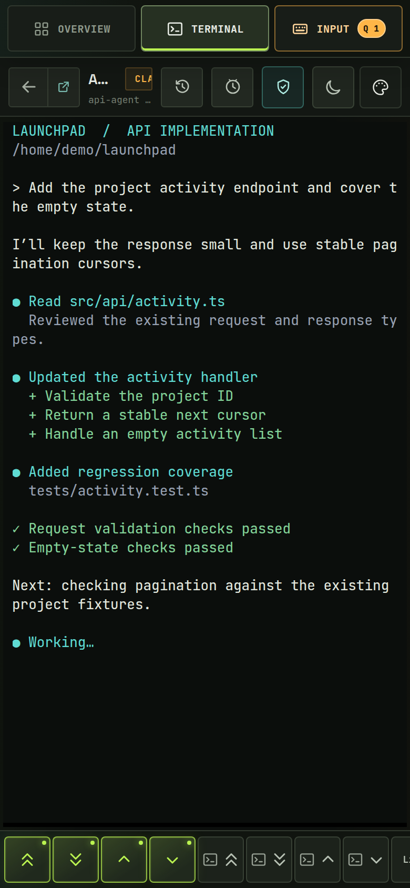
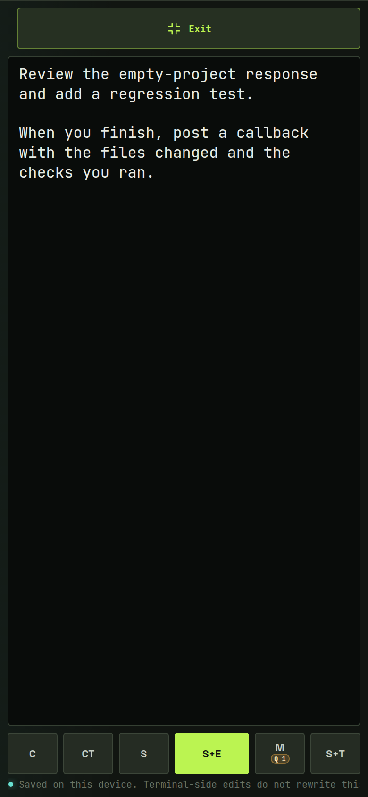

# Muxdeck

[](https://github.com/lovinrain/tmux-web-console/actions/workflows/ci.yml)
[](https://github.com/lovinrain/tmux-web-console/actions/workflows/secret-scan.yml)

A browser workspace for tmux and coding agents. Run parallel sessions, browse
project files, keep sticky notes, and track the agents that need your attention.
Pick up the same sessions from your desktop or phone; tmux keeps them running
when you disconnect.



## Why Muxdeck

- **A file browser beside your terminal.** Open the current project folder,
  search nested files, preview Markdown, images, PDFs, and sandboxed HTML pages,
  edit text, upload files, or download a selection as a ZIP. Stage a file's path
  directly into your next prompt.
- **Sticky notes that stay with your work.** Keep multi-page notebooks for
  Common, Workspace, and Session notes. They autosave to the server; floating,
  resizable windows can stay pinned while you switch sessions.
- **A callback list for parallel agents.** Watch working, ready, and ended
  sessions across one workspace or your global queue. Read agent-posted reports,
  filter and sort the list, open a session, and mark it reviewed. The panel
  shares one browser-local layout across scopes and workspaces.
- **Workspaces for many sessions.** Save ordered tabs, colored groups, nested
  sessions, quick links, and multi-pane layouts. Resume on another device and
  receive workspace changes live across open browser tabs.
- **Real terminals, comfortable input.** Use direct keyboard input or compose
  a prompt before sending it. Reuse snippets, keep session memos, attach files on
  desktop, and switch between terminal and input focus on mobile.
- **Context beyond scrollback.** Read local agent transcripts, search submitted
  Claude Code/Codex messages, and revisit saved output and session history.
  Launch and control agents through the authenticated API and `muxdeckctl`.
- **Tickets, PRs, and documents beside the session.** Link Jira tickets, GitHub
  PRs, and Google Docs with readable title chips, agent-reported status, and
  retained notes. Configure providers and agent access instructions through the
  UI or API; status refresh is off until enabled.

Agent status detection supports Claude Code, Codex, GitHub Copilot CLI, Cursor
Agent, and Grok Build. Ambiguous activity appears as **Unclear**.

[Muxpilot](docs/muxpilot/README.md) adds a main-agent workflow using Multica's
existing board, visible workers, and durable local recovery records. See its
[short user guide](docs/muxpilot/USER_GUIDE.md) and current release status.

## See it in action

### File browser

Browse and preview project files without leaving the session.



### Sticky notes

Keep your plan and handoff notes next to the terminal, with named pages and
separate scopes.



### Callback list

Use a row's pause button to put a callback **On hold** before removing it.
Held entries stay visible in gray with their messages intact, are excluded from
Ready counts, and can be filtered or grouped by status. Take an entry off hold to
restore its live status, or use the review button to remove it. Holds are shared
across callback scopes and browsers and survive reloads and service restarts.

See which agents are ready, read their reports, and review them from one queue.

Session tabs also show a blue background when observed work becomes ready
and you have not checked the session since. Open the tab by
clicking it or using session navigation to clear that indicator; a tab that was
already selected needs a fresh visit. Collapsed groups show an unchecked count.
The indicator uses the selected theme's colors and survives refreshes in that
browser profile, independently of callback-message review. It tracks observed
work episodes; a ready prompt can also mean the agent needs your approval.



### Dashboard and multi-pane workspaces

<table>
  <tr>
    <td width="50%"></td>
    <td width="50%"></td>
  </tr>
  <tr>
    <td align="center">Find a session or resume a workspace</td>
    <td align="center">Watch multiple sessions side by side</td>
  </tr>
</table>

### Mobile

<table>
  <tr>
    <td width="33%"></td>
    <td width="33%"></td>
    <td width="33%"></td>
  </tr>
  <tr>
    <td align="center">Switch sessions</td>
    <td align="center">Watch the terminal</td>
    <td align="center">Compose a prompt</td>
  </tr>
</table>

Screenshots use demo project data. The file browser, sticky notes, and floating
callback panel are desktop features.

## Quick start

Requirements: Python 3.11+, tmux 3.x, and Node.js `^20.19.0` or `>=22.12.0`.
Run Muxdeck as the Unix user who owns your tmux sessions.

```bash
git clone https://github.com/lovinrain/tmux-web-console.git
cd tmux-web-console
python3 -m venv .venv
.venv/bin/python -m pip install -e .
npm ci
npm run build
.venv/bin/python -m tmux_console.app
```

Open <http://127.0.0.1:7683/mux/>. Existing tmux sessions appear in the dashboard;
you can also create a session from **New Session**.

> [!CAUTION]
> The quick start has no authentication unless you configure it. Anyone who can
> reach the console can control shells as its Unix user. Keep it on loopback;
> configure authentication and protected access before allowing remote traffic.
> Follow the [deployment guide](AGENT_DEPLOYMENT_GUIDE.md) for login, HTTPS,
> reverse proxies, upgrades, and backups.

Closing a browser tab leaves tmux running. A workspace tab's **X** only removes
its navigation entry; **End** terminates the session after confirmation.
**Fit active** can resize the shared tmux window; choose **Size protected** when
observing a session used by another client.

## Documentation

- [Usage, shortcuts, and configuration](docs/REFERENCE.md)
- [Agent callback setup and posting reports](docs/AGENT_CALLBACKS.md)
- [Agent orchestration and `muxdeckctl`](docs/AGENT_ORCHESTRATION.md)
- [Session work links, status cards, and agent API](docs/WORK_LINKS.md)
- [Muxpilot project coordination proposal and implementation plan](docs/muxpilot/README.md)
- [Agent transcripts](docs/AGENT_TRANSCRIPTS.md), [submitted messages](docs/SUBMITTED_MESSAGES.md), and [saved scrollback](docs/SCROLLBACK.md)
- [HTTP and WebSocket API](docs/API.md)
- [Deployment, migration, and rollback](AGENT_DEPLOYMENT_GUIDE.md)
- [Security and vulnerability reporting](SECURITY.md)

## Development

~~~bash
.venv/bin/python -m pip install -e '.[dev]'
~~~

During development, choose the narrowest useful test selection:

| Scope | Command |
| --- | --- |
| One frontend test file | `npm test -- src/agentScrollPreferences.test.ts` |
| Frontend tests related to a source file | `npm run test:related -- src/agentScrollPreferences.ts` |
| Frontend tests affected by Git changes | `npm run test:changed` |
| One backend area | `.venv/bin/python -m pytest -q tests/test_terminal_input_api.py` |

Run `npm run typecheck` when TypeScript code changes.

`test:related` follows frontend imports from the supplied source files.
`test:changed` selects tests using Git changes and succeeds when none are
selected; that result does not establish coverage. A checkout with unrelated
edits can select many tests, so explicit files are useful during a focused fix.
Backend contracts and runtime dependencies still need their own relevant checks.

CI runs the complete Python and frontend suites. Use those locally for broad
changes or uncertain impact, rather than repeating them after every edit:

~~~bash
.venv/bin/python -m pytest -q
npm test
npm run build
~~~

For browser behavior, run the relevant spec, for example
`npm run test:e2e -- e2e/scroll-controls-visibility.spec.ts`. Browser tests require
a frontend built from the current source; use the deployment guide for staging
on a running installation. `npm run test:e2e` runs the complete browser suite.
Python and Playwright end-to-end tests use isolated disposable tmux sockets and
never target the default tmux server.

Keep exhaustive data cases in unit tests and representative interactions in
component/browser tests. Extend existing coverage when possible; consolidate
duplicate scenarios as their features change. See [the testing guidelines](AGENTS.md#testing).
