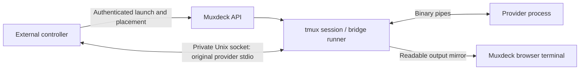

# Agent orchestration with Muxdeck

Muxdeck can host one tmux session per agent, display those sessions as nested
branches and groups in saved workspaces, and expose their launch and control
operations to a CLI or an external orchestrator. Use tmux for the visible
terminal and session lifetime. Use the agent's structured protocol or explicit
reports for task completion and communication that needs acknowledgement.

The existing workspace UI already supports the hierarchy; automation does not
need a separate agent-only kind of session. A session running a shell, an
interactive coding agent, or a structured-protocol runner can be organized in
the same workspace. Muxdeck does not supply a task scheduler, dependency graph,
agent mailbox, leader-election system, or agent permission sandbox. A controller
such as Multica owns those decisions.

## The hierarchy and its meaning

| Orchestrator concept | Muxdeck representation | Consequence |
| --- | --- | --- |
| Project or large epic | Saved workspace | Stable workspace ID, shared browser navigation and persistent organization. |
| Epic, phase, or agent squad | Workspace tab group | Named, colored, collapsible set of contiguous tabs; groups do not launch or stop processes. |
| Leader and delegated subtasks | Workspace `parents` mapping | Child tabs nest under a parent session; the relationship is local to that workspace. |
| One running agent | Native tmux session | Independent session and pane identity, current directory and process lifetime. |
| An execution attempt | Controller run ID plus launch `requestId` | Keep a distinct attempt ID; a reused session name is not a persistent process identity. |

For example, a project workspace may contain a `Payments` group with a
`payments-leader` session, nested `payments-api` and `payments-tests` sessions,
and a further `payments-migration-review` child under `payments-api`. Another
workspace can show the same live session with a different parent. Neither
nesting nor group membership changes Unix process parentage or permissions.

Saved workspaces preserve ended session references. Removing a tab or deleting
a workspace changes navigation; terminating a tmux session changes the live
process. Keep those operations distinct in the controller's cleanup policy.
Removing a parent promotes surviving children to the nearest surviving
ancestor. A native rename made through Muxdeck migrates its saved references;
renaming directly through tmux does not migrate name-keyed Muxdeck metadata.

Each workspace supports up to 256 tabs and 16 groups. A group must have
contiguous, disjoint membership. Parent links must refer to tabs in the same
workspace and must be acyclic. Discover current limits and enums from
`GET /api/capabilities` instead of embedding these limits in an adapter.

## Which communication channel to use

Reading a pane and sending keys is useful for interactive supervision. It is
insufficient as the only protocol for a reliable autonomous controller.

| Channel | Suitable use | What success means |
| --- | --- | --- |
| Pane capture | Human-readable progress, prompt inspection, debugging | A bounded snapshot of what tmux retained; it may contain partial, redrawn or repeated text. |
| Literal pane input and named keys | Initial prompts and deliberate steering of an interactive agent | tmux accepted input for the fenced pane. It does not acknowledge an agent turn. |
| Terminal WebSocket | Browser-style interaction and live terminal rendering | Bytes were delivered to a PTY attachment; terminal size and rendering rules still apply. |
| `muxdeckctl exec` | A provider's JSONL, JSON-RPC, ACP, or other stdio protocol | The controller receives the provider's actual stdout and stderr and its process exit status. |
| Callback messages | Durable completion reports and requests for human review | Muxdeck persisted a self-reported message, deduplicated by request ID when supplied. |

Terminal output has no general message boundary, task ID, acceptance receipt or
completion receipt. Alternate-screen applications redraw or erase output.
Scrollback is bounded; a snapshot is not an append-only event log. Prompts can
accept pasted text without executing it, and an Enter key can have different
meanings in a shell, agent editor or approval dialog. A terminal's idle
appearance is not proof that the task completed successfully.

Muxdeck's `agentState` is a conservative observation of terminal-visible
signals. Use it to prioritize attention, not to release a dependency or declare
a run successful. Session, workspace and callback SSE streams send current
snapshots and can coalesce changes; they are not a replayable per-token or
per-transition execution log. Reconnect by reading the latest snapshot.

An orchestrator that needs acknowledged agent-to-agent messages should retain
its own durable queue with message IDs, recipient/run identity, acceptance and
completion receipts, retry policy, and cancellation state. Deliver messages
through a provider's structured protocol or a cooperating agent tool. Keep
artifacts and authoritative results outside terminal text. Muxdeck's callback
inbox is useful for human review but is not that bidirectional mailbox.

## Installing and authenticating the CLI

Installing the Python package also installs `muxdeckctl`:

```bash
.venv/bin/python -m pip install -e .
source .venv/bin/activate
muxdeckctl --help
```

The CLI talks to the running service. It does not select a second tmux server or
edit the workspace JSON files directly. Its default base URL is the local
Muxdeck installation; set `MUXDECK_URL` or use `--url` when it differs. Read a
dedicated control credential from `MUXDECK_CONTROL_TOKEN_FILE` or `--token-file`:

```bash
umask 077
export MUXDECK_URL=http://127.0.0.1:7683/mux
export MUXDECK_CONTROL_TOKEN_FILE="$HOME/.config/muxdeck/control-token"
muxdeckctl capabilities
muxdeckctl sessions list
muxdeckctl workspaces list
```

Control tokens are configured on the service with
`MUXDECK_CONTROL_TOKEN_FILE`. They permit automation's session, terminal,
workspace and callback operations, not general filesystem or account access.
Here terminal operations mean the guarded capture/input APIs; WebSocket
attachments keep the usual browser/server authentication.
They are still powerful shell-control credentials: a holder can launch a
program with the service user's Unix privileges. They do not restrict one
agent to one workspace. Give subordinate agents the narrow callback credential
when all they need is posting reports, and keep the control token with the
trusted controller.

`MUXDECK_CALLBACK_TOKEN_FILE` is a separate credential. It cannot launch agents
or write to panes. Neither token bypasses Host or Origin checks. Invalid
supplied bearer credentials fail even when another authentication method would
otherwise succeed. Keep credential files outside the checkout, mode `0600`,
and their directory mode `0700`; never put the token value in CLI arguments,
transcripts or source files. See the [deployment runbook](../AGENT_DEPLOYMENT_GUIDE.md)
for provisioning. Use loopback HTTP or HTTPS for remote API access. Do not expose
an unauthenticated console to provide automation access.

Except for transparent `exec`, commands emit JSON to stdout and diagnostics to
stderr. They return a nonzero status for HTTP errors and do not automatically
retry mutations. `muxdeckctl api METHOD /api/... --json @request.json` exposes
the documented JSON API for operations without a dedicated CLI command.

## Launching interactive agents

Session creation supports three explicit modes:

| Mode | Behavior |
| --- | --- |
| `default` | Existing tmux default-shell/default-command behavior, preserving browser and old API callers. |
| `shell` | Explicit shell session that bypasses tmux's configured default command. |
| `command` | Launch the supplied argument vector as a command, without interpreting it as a shell script. |

Use an absolute working directory and an explicit argument vector. Shell
expansion, pipelines and redirection require deliberately launching a shell
such as `/bin/sh -c`; ordinary argument values stay literal. An environment
overlay is applied per launch. Keep secrets out of environment values submitted
in a JSON request when they can instead be read by the provider from its
existing private credential files. The service and tmux environment remain the
execution context; this is not an isolated container.

Create a project workspace and leader first; retain the returned `workspace.id`
as `WORKSPACE_ID` in the following commands:

```bash
muxdeckctl workspaces create 'Payments project'
muxdeckctl sessions launch \
  --mode command --name payments-leader \
  --cwd /srv/projects/payments --workspace WORKSPACE_ID \
  --request-id payments-leader-attempt-1 \
  -- codex
muxdeckctl workspaces group create WORKSPACE_ID Payments payments-leader \
  --id payments --color cyan
```

Launch a delegated child in the leader's group and save its receipt privately:

```bash
muxdeckctl sessions launch \
  --mode command --name payments-api \
  --cwd /srv/projects/payments \
  --workspace WORKSPACE_ID --parent payments-leader --group payments \
  --request-id payments-api-attempt-1 \
  -- codex > payments-api.launch.json
```

Use `--group GROUP_ID` to place the new tab in an existing workspace group.
Create the workspace, parent and group first, or create the grouping after the
first session. Nested children inherit their parent's group; an explicit group
must match the parent's group. `--remain` retains the pane after the command
exits so its output and real exit status can be inspected. `--no-remain` lets tmux remove
the finished pane, which can also remove a single-pane session. Retain the
launch receipt and the controller's attempt ID rather than relying on the
session name.

The REST launch operation is `POST /api/sessions`:

```json
{
  "name": "payments-api",
  "directory": "/srv/projects/payments",
  "launchMode": "command",
  "command": ["codex"],
  "environment": {"PROJECT_TASK_ID": "PAY-42"},
  "remainOnExit": true,
  "requestId": "payments-api-attempt-1"
}
```

Launch and workspace placement are separate commits. Creating a tmux process
cannot be atomically committed with persistent workspace state. A placement
conflict must not trigger another launch: retain the created-session receipt,
fetch the current workspace and add/nest that existing session. The CLI reports
a placement failure with exit status `1` and a JSON object containing
`partialSuccess: true`, `created: <receipt>` and `placement: "failed"`, so it can
be recovered. Invalid parent/group configuration is checked before launching,
but concurrent workspace edits can still cause a conflict after creation.

Existing sessions can also be added, nested and promoted without relaunch:

```bash
muxdeckctl workspaces add WORKSPACE_ID payments-tests
muxdeckctl workspaces parent WORKSPACE_ID payments-tests payments-leader
muxdeckctl workspaces group add WORKSPACE_ID payments payments-tests
muxdeckctl workspaces parent WORKSPACE_ID payments-tests --detach
```

### Safe retries and launch uncertainty

Use a stable `requestId` for one launch attempt (1-128 ASCII letters, digits,
underscores or hyphens). The CLI generates an ID when omitted and includes it
in its receipt/error; pass an explicit ID when it must survive controller
restart. Completed identical retries return the saved receipt; reusing an ID
with different launch inputs returns
`409`. Request fingerprints and receipts are stored in a private
`launch-requests.sqlite3` database. The store does not save command argument
vectors or environment overlays as plaintext request bodies.

Request IDs are retained indefinitely, including failed and uncertain attempts;
there is no automatic expiry or pruning. The store permits 100,000 retained
IDs and refuses new IDs with `503` after that lifetime cap. Budget this for
long-lived controllers and preserve the database when retiring an installation.
Do not delete it as capacity cleanup while retries of earlier attempts remain
possible; that would remove their duplicate-launch fences.

The service reserves the ID before creating the tmux session. If it crashes
between reservation, tmux creation and receipt persistence, the request remains
uncertain and a retry returns `409` rather than launching a possible duplicate.
Inspect the inventory and controller evidence before starting a new attempt.
Preserve this database across deployment and rollback; deleting it loses the
duplicate-launch fence. Without a request ID, creation has the original
non-idempotent behavior.

This prevents blind relaunch on a lost response; it does not promise exactly-once
agent execution. A receipt can refer to a session that has ended since it was
created. External side effects and successful task completion belong to the
provider/controller protocol. Do not generate a new request ID merely because
a timeout occurred.

## Observing, steering and stopping a session

```bash
muxdeckctl sessions get payments-api
muxdeckctl sessions capture payments-api
muxdeckctl sessions input payments-api 'Please inspect the failing test first.'
muxdeckctl sessions input payments-api --stdin --allow-multiline --submit < task-prompt.txt
muxdeckctl sessions keys payments-api Enter
muxdeckctl sessions wait payments-api --timeout 300
```

Input is literal and appends an Enter key only when `--submit` is present.
Multiline text is refused by default; `--allow-multiline` explicitly permits
line breaks. Those embedded newlines still reach the receiving program: a shell
or an application without bracketed-paste handling can execute or submit each
line even without `--submit`. tmux brackets a paste only when the receiver
requests that mode;
Muxdeck cannot turn an arbitrary terminal into a reliable message boundary.
Named keys are a separate operation. Choose the operation for the agent's input UI;
multiline prompts need its verified paste/submit behavior. Use the structured
stdio route for unattended protocol messages. Do not mix two controllers
or simultaneous human typing without an explicit ownership policy.

The CLI fetches the current pane identity before pane-scoped commands. For a
specific execution attempt, pass the saved launch identity explicitly using
`--identity @payments-api.launch.json`; discovering by name alone can select a
later replacement that happens to reuse the name. The identity includes native
session ID, session
creation time, tmux server start time/PID, pane ID and pane PID. REST capture
and input require these fields. A `409` asks the controller to reconcile the
changed identity; substituting new values and resending uncertain input can
send the same prompt twice. Pane PID fences pane respawn as well as session and
server replacement.

```bash
muxdeckctl sessions capture payments-api --identity @payments-api.launch.json
muxdeckctl sessions input payments-api --identity @payments-api.launch.json \
  --stdin --allow-multiline --submit < task-prompt.txt
```

`wait` reports the tmux command's actual exit status when a retained pane is
dead (capped at 255 for the CLI exit code). A timeout returns `124` and does not
cancel the program. An interactive agent may keep running after completing a
turn, so its process exit is different from task
completion. For deliberate cancellation use:

```bash
muxdeckctl sessions cancel payments-api --policy interrupt
```

Interrupt delivery can be ignored, intercepted or handled as an application
action; it is not proof that a process stopped. A controller may deliberately
select termination when its operator policy authorizes ending the entire
identified session. Do not implement cancellation by killing the tmux server.

## Transparent stdio programs in tmux

A provider launched with `muxdeckctl exec` runs through a local bridge in its
tmux session. Its real stdin, stdout and stderr travel over a private Unix
socket to the invoking controller. Output is also mirrored into the pane for
Muxdeck observation. The command does not replace provider stdout with a JSON
launch receipt:

```bash
muxdeckctl exec \
  --cwd /srv/projects/payments \
  --workspace WORKSPACE_ID --parent payments-leader \
  -- /absolute/path/to/provider PROVIDER_ARGUMENTS
```

This mode preserves structured stdio exchange, EOF and process exit status
without trying to reconstruct a protocol from rendered terminal output. The
visible pane is a best-effort readable UTF-8 mirror, with terminal control bytes
replaced and display output dropped if the mirror blocks. The controller's
stdout/stderr stay byte-exact; the pane is not the source of protocol bytes.
Ordinary browser typing or `/input` text in this monitor pane is not forwarded
to the provider's stdin. Steer it through the owning controller's protocol
(for example, Multica's supported supplemental messages), preserving the
provider's framing and request IDs. Bounded flow
control keeps a provider that stops reading stdin from blocking cancellation,
and output backpressure is applied to the controller protocol.
The bridge forwards cancellation to the owned provider process group and stops
it if the controlling connection disappears. Unlike an ordinary detached interactive
launch, `exec` therefore remains owned by the invoking process. Browser
disconnect does not cancel it; controller disconnect does.

On Linux the runner adopts and tracks provider descendants so cancellation can
also clean up children that create their own sessions/process groups. This is
bounded process cleanup, not a cgroup containment boundary. A controller killed
with SIGKILL closes the socket and lets the runner perform cleanup; a runner
killed with uncatchable SIGKILL cannot guarantee cleanup of every detached
descendant. Providers that deliberately escape ownership need an external
container/cgroup policy if that guarantee is required.
After the main provider exits, the runner drains buffered output and cleans up
remaining descendants instead of waiting indefinitely for inherited pipe
descriptors. Later output from detached descendants is outside the completed run.



The bridge requires the CLI and Muxdeck service to run on the same host and
with the same effective Unix UID, because the runner must access the private
socket. Peer-user checks protect the private socket. The caller's full
environment, current directory and original argument vector are transferred
through that socket, rather than included in the HTTP launch request or tmux
command line. Workspace placement succeeds before the bridge launches the
provider. Remote HTTP launch and terminal control remain possible, but `exec` is
not a remote stdio tunnel. Providers see pipes rather than a TTY; use ordinary
`sessions launch --mode command` for interactive TUI agents. This implementation
does not make a provider protocol interchangeable with another provider's
protocol.
The runner replaces inherited `TMUX` and `TMUX_PANE` with its new session's
values. The caller's interpreter, installed runner and private socket paths
must be visible in the service's local filesystem namespace; a container or
chroot with inaccessible caller paths is not a supported transparent bridge.

The bridge requires Unix `waitid`/`WNOWAIT` support to retain safe process
identity during cleanup. On Linux, subreaper setup must succeed before a
provider is launched; environments that block that facility fail closed rather
than silently weakening ownership. Lightweight version/help probes do not need
the bridge or API and still delegate directly.

## A Multica custom runtime wrapper

Inspection of Multica's current source shows that its daemon owns provider
stdio and lifecycle. Claude uses streaming JSON input/output and keeps stdin
open for control responses and supported task supplements. Codex uses its
app-server protocol. Other backends include ACP and provider-specific streams.
Replacing these with pane capture and `send-keys` would lose their framing,
errors, result messages and cancellation behavior.

Multica already supports workspace custom runtime profiles: `runtime_type`
selects the compatible backend, `command_name` selects an executable, and
`fixed_args` prefixes its argument vector. A provider-specific executable
wrapper can route that backend's unchanged argument vector through
`muxdeckctl exec`.

For example, install an executable named `muxdeck-claude` on the daemon host.
Replace the absolute CLI/provider paths and workspace ID with the installation's
values:

```sh
#!/bin/sh
if [ "$#" -eq 1 ]; then
  case "$1" in
    --version|-V|--help|-h)
      exec /absolute/path/to/claude "$@"
      ;;
  esac
fi
exec /absolute/path/to/muxdeck/.venv/bin/muxdeckctl \
  --url http://127.0.0.1:7683/mux \
  --token-file /absolute/private/path/control-token \
  exec --workspace MUXDECK_WORKSPACE_ID \
  -- /absolute/path/to/claude "$@"
```

The wrapper forwards each original argument without reparsing it, inherits the
daemon's working directory and environment (apart from the new tmux identity
variables), and does not print anything of its
own to provider stdout. Do not use a bare `muxdeckctl sessions launch` wrapper:
Multica would receive a launch receipt instead of provider protocol output and
the wrapper would exit before the run completed.

Version/help probes are deliberately passed straight through so discovery does
not leave a tmux session for each probe. `muxdeckctl exec` itself also delegates
a sole `--version`, `-V`, `--help` or `-h` argument directly without API access.
Check the chosen backend's additional
model/auth probes and add exact pass-through cases as needed. Do not broadly
bypass every unfamiliar argument: execution commands also contain flags. Keep
the real provider path distinct from the wrapper to avoid recursive launch.

Create a Multica profile using its own authenticated CLI:

```bash
multica runtime profile create \
  --runtime-type claude \
  --command-name muxdeck-claude \
  --display-name 'Claude in Muxdeck'
multica runtime profile set-path PROFILE_ID \
  --path /absolute/path/to/muxdeck-claude
```

Select that custom runtime for the agent; a command wrapper does not change its
protocol family. In the inspected Multica checkout, create/update have no
`--fixed-arg` flag. Configure `fixed_args` through its UI/API when needed, or
keep the fixed Muxdeck arguments inside the provider-specific wrapper. The
Multica API collection is
`/api/workspaces/{multicaWorkspaceId}/runtime-profiles`; an example create body
is:

```json
{
  "display_name": "Claude in Muxdeck",
  "runtime_type": "claude",
  "command_name": "muxdeck-claude",
  "fixed_args": [],
  "enabled": true
}
```

Muxdeck workspace IDs and Multica workspace IDs belong to different services.
Map them explicitly. A wrapper can choose the appropriate Muxdeck workspace
from controller configuration; task/epic nesting requires a mapping to the
controller's parent session and group as well. Do not guess that mapping from
provider output. Static wrapper placement demonstrates the transport; an
adapter can use the same CLI/API with its own run/task metadata.

Deployment evidence should retain the original private snapshot from
`scripts/check_deployment.py`. Its pane comparison is strict by default; after
reviewing independent user activity, `verify --allow-added-panes` permits added
session/pane identity pairs and `--allow-command-changes` permits foreground
command changes.
Both still reject missing, moved or respawned original panes and changed dead
flags; tmux-server, service and authentication checks remain strict. The report's
`checks.paneComparison` records counts and pane/command differences for valid
identity rows, including rejected comparisons. Review that evidence instead of
replacing the baseline to hide changes. Documentation/tooling updates need neither a frontend build
nor a service restart.

The bridge is tested with synthetic protocol programs and isolated tmux
sessions. The actual Multica daemon, authenticated provider runs, provider
discovery variants and account-specific permissions require an integration
smoke test on the intended host before treating this profile as production
validated. No Multica source change is required for the wrapper shape shown
here; a supported native integration could improve automatic task mapping.

## Concurrent placement and reports

Use granular workspace session/group endpoints for adds and removals. For
whole-workspace `PATCH`, include both `sessionRevision` and
`expectedUpdatedAt` from the most recent snapshot. `sessionRevision` fences
native renames and transfers across all workspaces;
`expectedUpdatedAt` fences concurrent edits of the specific workspace. On
`409`, fetch, reconcile the intended edit and retry. Updating only the version
on an old replacement array can erase another controller's work.

Copy/move transfers commit workspace membership and placement together. To
move a complete nested branch, include the descendants; a single-session
transfer moves only that tab. `destinationParent` explicitly nests the branch
under an existing destination tab, or `null` promotes it to the top level.
Validation precedes source removal. This atomic workspace transfer does not
move the processes to another tmux server or filesystem checkout.

An agent can post a report using a private JSON file and either a callback-only
credential with the callback helper or the controller credential:

```json
{
  "message": "PAY-42 attempt 1: implementation ready; focused tests passed.",
  "sessionName": "payments-api",
  "agentType": "codex",
  "cwd": "/srv/projects/payments",
  "requestId": "pay-42-attempt-1-report"
}
```

```bash
muxdeckctl api POST /api/callback-messages --json @report.json
muxdeckctl api GET '/api/callback-messages?status=all&after=0&limit=100'
```

For durable agent reports use `/api/callback-messages` or the
[callback helper](AGENT_CALLBACKS.md). Include a stable request ID for one
report and retain the controller run ID in its message. Identical retries are
deduplicated across service restart; a different body with the same ID is a
conflict. Reading does not review a message, and review preserves its history.
Reported session/agent metadata is self-reported: a callback is not proof that
the current pane ran the reported task, nor proof that tests passed. The
controller should verify artifacts and test results before accepting completion.

For the full route and identity contracts, see the [HTTP API reference](API.md).
For preserving live sessions, launch-request state and private credentials
during upgrades, follow the [deployment runbook](../AGENT_DEPLOYMENT_GUIDE.md).

## Multica source inspected

The integration analysis used Multica commit
`e31da86c90794b5c488279a3ead13ac2f31ac269`. The relevant contracts are its
[runtime-profile representation](https://github.com/multica-ai/multica/blob/e31da86c90794b5c488279a3ead13ac2f31ac269/server/internal/daemon/client.go#L1105),
[profile CLI and deliberate omission of `--fixed-arg`](https://github.com/multica-ai/multica/blob/e31da86c90794b5c488279a3ead13ac2f31ac269/server/cmd/multica/cmd_runtime_profile.go#L81),
[profile API creation](https://github.com/multica-ai/multica/blob/e31da86c90794b5c488279a3ead13ac2f31ac269/server/internal/handler/runtime_profile.go#L120),
and its [Claude](https://github.com/multica-ai/multica/blob/e31da86c90794b5c488279a3ead13ac2f31ac269/server/pkg/agent/claude.go)
and [Codex](https://github.com/multica-ai/multica/blob/e31da86c90794b5c488279a3ead13ac2f31ac269/server/pkg/agent/codex.go)
provider backends. Recheck these contracts when upgrading either project.
